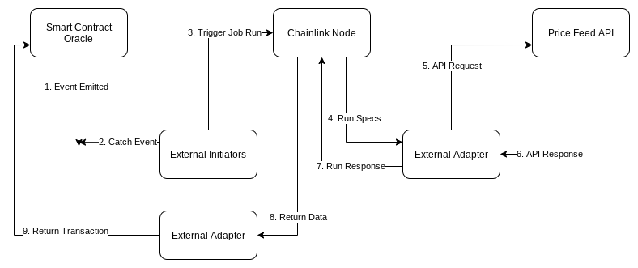

# Chainlink Introduction
How to connect Conflux Network and Chainlink. (Conceptual application)

Resources:
- Run a Chainlink node: https://docs.chain.link/docs/running-a-chainlink-node
- External Initiators for Conflux: https://github.com/Conflux-Network-Global/external-initiator
- Chainlink job specifications: https://docs.chain.link/docs/job-specifications
- Chainlink built-in adapters: https://docs.chain.link/docs/adapters
- Chainlink initiators: https://docs.chain.link/docs/initiators
- More advanced demo code: https://github.com/Conflux-Network-Global/demo-cfx-chainlink
